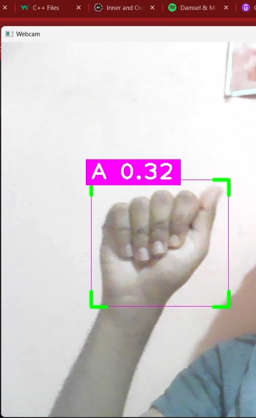
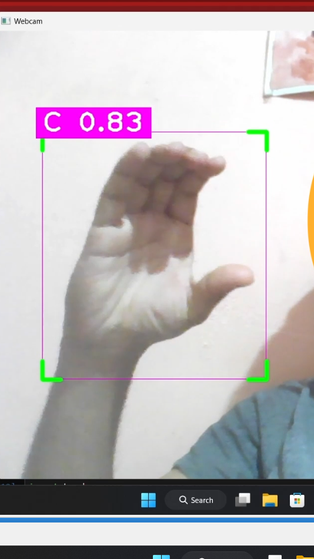
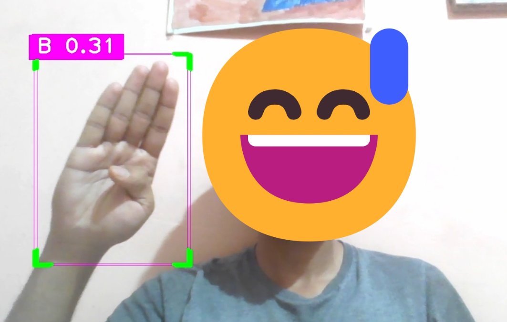

# American Sign Language (ASL) Hand Sign Detector using YOLOv8

This repository contains Python code for detecting American Sign Language (ASL) hand signs using YOLOv8, a state-of-the-art object detection model. The model was trained on a dataset obtained from Roboflow, consisting of ASL hand sign images.

## Overview

The ASL hand sign detector utilizes the YOLOv8 model trained on the provided dataset to detect and localize hand signs in images. It leverages the COCO dataset's pre-trained weights and was trained for 10 epochs on Google Colab for GPU acceleration.

## Requirements

- Python 3.x
- OpenCV (cv2)
- NumPy
- YOLOv8 Model (yolov8l.pt)
- Dataset from Roboflow (American Sign Language Letters)

## Usage

1. Clone this repository:

```bash
https://github.com/UmangBarewar/American_Sign_Language_Detector.git
```

2. Download the YOLOv8 model (yolov8l.pt) and place it in the repository directory.

3. Run the Python script:

```bash
python ASL_Hand_Sign_Detector.py
```

4. The webcam will open, and you can start making ASL hand signs in front of the camera. The detected hand signs will be highlighted in real-time.

## Training and Model Details

- YOLOv8 model: yolov8l.pt
- Training dataset: American Sign Language Letters from Roboflow
- Training epochs: 10 (Can be increased for improved accuracy)

## Output Image

Below is an example of the output image showing the detected ASL hand signs:




## Contributions

Contributions to improve the functionality, performance, or documentation of this project are welcome. If you encounter any issues or have suggestions for improvements, please open an issue or submit a pull request.

## License

This project is licensed under the MIT License. Feel free to use, modify, and distribute the code for non-commercial purposes. However, please note that there is no implied support or liability for this project. Use at your own risk.

---
